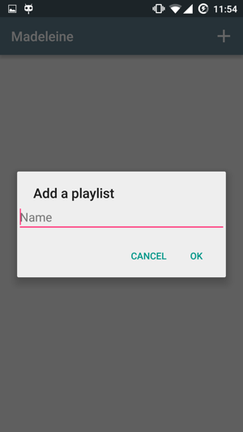

# Android Playground

Ce dépot regroupe plusieurs projets Android.

Certains projets sont proposés par le site Udacity.
Madeleine et Maps sont des projets liés au cours d'Android du Master IAGL.
Maps est une initiation à l'API google maps.

## Madeleine

Comme la madeleine de Proust, la musique nous aides à nous remémorer des moments passés.

Madeleine permet de gérer les musiques en les regroupants en playlist.

Les musiques peuvent être écoutées par la suite via l'application Youtube.

L'application est composée de 2 activités: PlaylistActivity et SongActivity.
Une activité MainActivity existe pour le lancement (splash).
Les titres des playlists et des chansons sont stockés sur une base de données de type SQLite.
ORMLite est utilisé pour faciliter l'usage des données.

